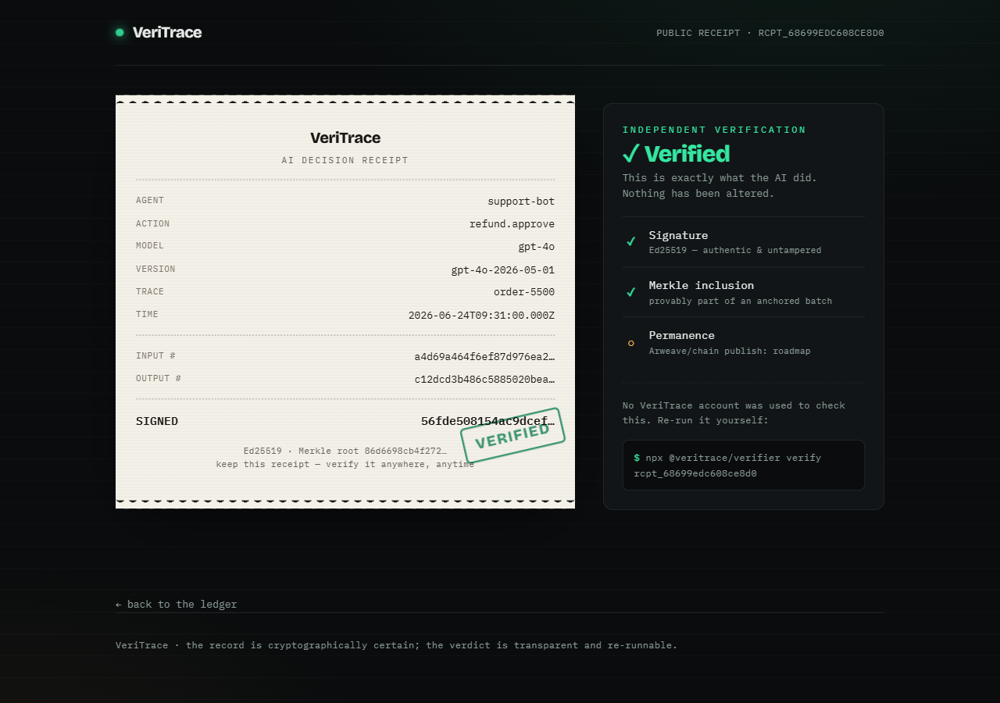

<div align="center">

# 🧾 VeriTrace

### Stripe Receipts for AI Agents

**When an AI agent approves a refund, changes production code, or executes a trade, VeriTrace creates independently verifiable proof of exactly what happened — and whether it was right.**

Payments have receipts. AI decisions should too.

[](#status)
[](#license)
[](#how-it-works)

</div>

---

## The problem: AI agents now spend your money, and you can't prove what they did

Agents are moving from chat to **action** — approving refunds, trading, shipping code, paying invoices. When one of those actions goes wrong, you get a clean response that's **silently wrong**, and the only record lives on *your* servers or the *vendor's*, where it can be edited. That's not evidence. It's a story you're asking an auditor, a customer, a regulator, or a court to take on faith.

**VeriTrace** wraps any agent or LLM call in 3 lines and emits a **signed, tamper-proof receipt**: the inputs, the model + exact version, the output, and a **signed automated verdict on whether the action was correct**. Receipts are Merkle-batched and **anchored permanently to [Arweave](https://arweave.org) + on-chain**, so **anyone can verify what your AI did — with an open-source CLI, no account, and zero trust in VeriTrace or the model vendor.**

---

## Where it pays for itself

**💸 AI customer support — disputed refund**
> An AI approved a **$5,000 refund**. Months later the customer disputes it and your team can't tell whether a human or the agent approved it, or on what basis.
> **VeriTrace:** the signed receipt shows the agent, the exact prompt + model version, the inputs it saw, and the verdict — settled in seconds, not a forensic project.

**📉 AI trading — a bad fill**
> An autonomous strategy bought NIFTY futures and took a **₹2 lakh loss**. Which model? Which prompt? What reasoning led there?
> **VeriTrace:** an immutable, time-anchored record of every decision — the evidence you need for risk review, LP reporting, or a regulator.

**🚨 AI coding agents — a production outage**
> An agent pushed broken code and took down prod. Which agent, which commit, which prompt, which model version?
> **VeriTrace:** a verifiable chain from the agent's decision to the change it made — accountability instead of guesswork.

These aren't logging niceties. They're **money lost, disputes, and liability** — the things people already pay to control.

---

## Not just *what* happened — *whether it was correct*

Most tools log the action. VeriTrace also attaches a **signed evaluation verdict** to each receipt: an automated correctness check (LLM-judge today, pluggable), with a confidence score, signed so it can't be quietly rewritten later.

```jsonc
{
  "action": "refund.approve",
  "result": "approved",
  "model": "gpt-4o",
  "modelVersion": "gpt-4o-2026-05-01",
  "verdict": { "assessment": "correct", "confidence": 0.97, "judge": "llm-judge-v1" },
  "signature": "ed25519:8fa2…",     // over the whole receipt — tamper = invalid
  "anchor": { "arweave": "tx:Kx9…", "chain": "base:0x4c…" }   // permanent + on-chain
}
```

> ⚖️ **Honest framing:** the verdict is an *automated, signed assessment with a confidence score* — not a claim of absolute truth. That's the credible version: the **record is cryptographically certain; the judgment is transparent and auditable.** You can always re-run a different judge against the same immutable inputs.

This turns logging into **accountability**.

---

## Why VeriTrace, not LangSmith / Langfuse / OpenTelemetry?

|  | Observability tools | **VeriTrace** |
|---|---|---|
| Purpose | Debugging & metrics | **Verifiable evidence** |
| Trust model | Trust the vendor's logs | **Cryptographic, no trust required** |
| Storage | Internal, **mutable** | **Immutable** (Arweave + on-chain) |
| Who can verify | You (logged in) | **Anyone, no account** |
| Category | Developer tool | **Compliance & accountability layer** |
| When an output is silently wrong | A line in a dashboard | A **signed verdict** on a tamper-proof receipt |

They tell *you* what your AI did. VeriTrace lets *anyone else* prove it — which is exactly what audits, disputes, and insurance require.

---

## How it works

```
   your agent              VeriTrace SDK                  permanence layer
 ┌────────────┐   wrap()  ┌──────────────┐  POST signed  ┌──────────────────┐
 │ llm / tool │──────────▶│ hash + sign  │──────────────▶│ Merkle-batch →    │
 │  call      │           │ (Ed25519)    │   receipt     │ Arweave + L2 root │
 └────────────┘           └──────┬───────┘               └────────┬─────────┘
                                 │ signed eval verdict             │
                          anyone, no account, no trust required    ▼
                          ┌─────────────────────────────────────────────────┐
                          │  `veritrace verify <id>` → ✅ sig · merkle ·      │
                          │   arweave · on-chain root all check out          │
                          └─────────────────────────────────────────────────┘
```

1. **Wrap** any call — your agent runs exactly as before.
2. **Sign** — the receipt is canonicalized and Ed25519-signed at the edge.
3. **Judge** — a signed verdict on whether the action was correct is attached.
4. **Anchor** — receipts are Merkle-batched, stored on Arweave, the root written on-chain.
5. **Verify** — anyone re-checks signature, Merkle proof, Arweave payload, and on-chain root. Change one byte → verification fails.

---

## The network effect: Verified AI Score *(built)*

Every receipt is a verifiable data point, so every agent accrues a **public, cryptographically-backed track record** — computed live from verified receipts only (a tampered receipt's self-reported verdict is never counted):

```
trade-exec    ·  success 100.0%  ·  33 verified  ·  integrity 100.0%
support-bot   ·  success  93.8%  ·  48 verified  ·  integrity  98.0%   ← one tampered receipt detected
deploy-bot    ·  success  85.7%  ·  21 verified  ·  integrity 100.0%
```

This is the **reliability leaderboard** (`@veritrace/score` + `GET /api/v1/agents`) — public agent profiles and a portable reputation layer, the defensible network effect an internal logging tool can't replicate. Live on the home page.

---

## Quickstart — run the whole thing in 30 seconds

The core, SDK, and verifier work **today**, locally, with no accounts and no network:

```bash
git clone <this-repo> && cd veritrace
pnpm install
pnpm demo
```

You'll see a real AI refund decision get a **signed receipt**, verify ✅, then watch verification **fail ❌ the instant the receipt is altered**:

```
  AI decision: approved a $5000 refund for acme-corp
  Signed receipt written → examples/out/receipt.json

  $ veritrace-verify receipt.json
  ✅ VERIFIED — signature ok

  Someone alters the receipt to hide the approval…
  $ veritrace-verify receipt.tampered.json
  ❌ FAILED — signature bad
  → Tampering is mathematically detectable. The record can't be quietly rewritten.
```

### Or open the web app

```bash
pnpm --filter @veritrace/web dev   # → http://localhost:3000
```

A public **receipt ledger** with live verification, and a shareable verify page (`/r/<id>`) that renders each AI decision as a tamper-proof receipt with an independent verdict — including a deliberately **altered** one that fails:

| Receipt ledger | Verified ✅ | Altered ❌ |
|---|---|---|
|  |  |  |

### The integration is 3 lines

```ts
import { VeriTrace } from "@veritrace/sdk";

const vt = new VeriTrace({ privateKey, agent: "support-bot" });

const approveRefund = vt.wrap(
  (order) => agent.run(order),                 // your real agent/LLM call
  { action: "refund.approve", model: "gpt-4o", modelVersion: "gpt-4o-2026-05-01" }
);

await approveRefund(order); // runs your agent + emits a signed receipt
```

Anyone verifies it — no VeriTrace account needed:

```bash
veritrace-verify receipt.json   # ✅ signature ok  ·  ⚪ anchored (Arweave + chain: roadmap)
```

> ⚠️ **Status:** signing, the `wrap()` SDK, **Merkle anchoring + inclusion proofs**, and independent verification are implemented and tested (**40/40**). Publishing the batch root to **Arweave** and **Base Sepolia** is implemented as pluggable backends (`@veritrace/anchor`) and is credential-gated — it needs a funded testnet wallet / Arweave JWK to run live. The hosted dashboard is next — see [Roadmap](#roadmap).

---

## What's in this repo

```
veritrace/
├─ packages/
│  ├─ core/        ✅ canonicalization, sha256, Ed25519 sign/verify, Merkle proofs (tested)
│  ├─ sdk-ts/      ✅ npm: @veritrace/sdk — wrap() any call into a signed receipt (tested)
│  ├─ anchor/      ✅ Merkle-batch receipts → publish root (local / Arweave / Base Sepolia)
│  ├─ verifier/    ✅ OSS verify lib + `veritrace-verify` CLI, zero trust required (tested)
│  ├─ score/       ✅ Verified AI Score — per-agent reliability from verified receipts (tested)
│  └─ sdk-py/      ⏳ PyPI: veritrace
├─ apps/web/       ✅ Next.js ingestion API + receipt ledger + public verify pages
├─ workers/
│  └─ eval-judge/  ✅ LLM-as-judge scoring, deployable on Nosana decentralized GPU
└─ README.md
```

### `@veritrace/core` (working today)

| Function | What it does |
|---|---|
| `canonicalize(obj)` | Deterministic JSON (recursively sorted keys) so signatures are order-independent |
| `sha256Hex(input)` | Hash inputs/outputs without storing raw payloads |
| `generateKeypair()` | Ed25519 keypair (hex) |
| `signReceipt` / `verifyReceipt` | Sign & verify; tampering or wrong key → `false` |
| `buildMerkleRoot` / `getMerkleProof` / `verifyMerkleProof` | Batch receipts and prove inclusion against an anchored root |

```bash
cd packages/core && pnpm test    # 14 passing
```

---

## Tech stack (100% free / open-source)

**Core:** TypeScript · `@noble/curves` (Ed25519) · `@noble/hashes` (sha256) · custom Merkle
**Storage & anchoring:** Arweave (permanent) · Base/Polygon L2 root via `viem`
**App:** Next.js 15 · Prisma · Supabase Postgres · Neo4j AuraDB (decision graph) · Algolia (search)
**Jobs:** BullMQ · Upstash Redis · **Eval:** Nosana (decentralized) / Ollama / OpenRouter
**Ops:** Vercel · Sentry · Umami · Docker · GitHub Actions

---

## Status

- ✅ Monorepo scaffolded (pnpm workspace), **64/64 tests passing**, web app builds clean
- ✅ `@veritrace/core` — canonicalization, Ed25519 sign/verify, Merkle proofs
- ✅ `@veritrace/sdk` — `wrap()` → signed receipts
- ✅ `@veritrace/anchor` — Merkle-batch + pluggable publish (local / Arweave / Base Sepolia)
- ✅ `@veritrace/verifier` — independent verify lib + `veritrace-verify` CLI
- ✅ `@veritrace/score` — Verified AI Score leaderboard (per-agent reliability)
- ✅ `@veritrace/web` — ingestion API, receipt ledger, leaderboard, public verify pages (no DB)
- ✅ `@veritrace/eval-judge` — LLM-as-judge worker, deployable on Nosana decentralized GPU
- ✅ Runnable end-to-end demo (`pnpm demo`)
- ⏳ Live Arweave/chain anchoring (credential-gated) · Postgres persistence · `sdk-py`

---

## Roadmap

1. **SDK** (`wrap()`) + ingestion API (signature-verified receipts)
2. **Eval worker** — signed verdicts (Nosana / Ollama)
3. **Anchoring** — Merkle batches → Arweave + on-chain root
4. **Verifier CLI** — independent, zero-trust verification
5. **Dashboard** — receipts, leaderboard, public verify pages ✅ (Postgres persistence next)
6. **Verified AI Score** — reputation layer & leaderboards ✅ → framework adapters → zkML verdicts → insurance-evidence exports → open receipt standard (RFC)

---

## License

MIT
